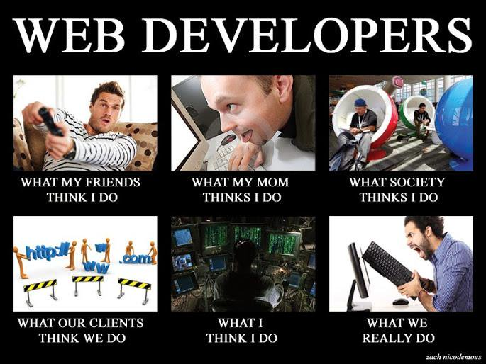
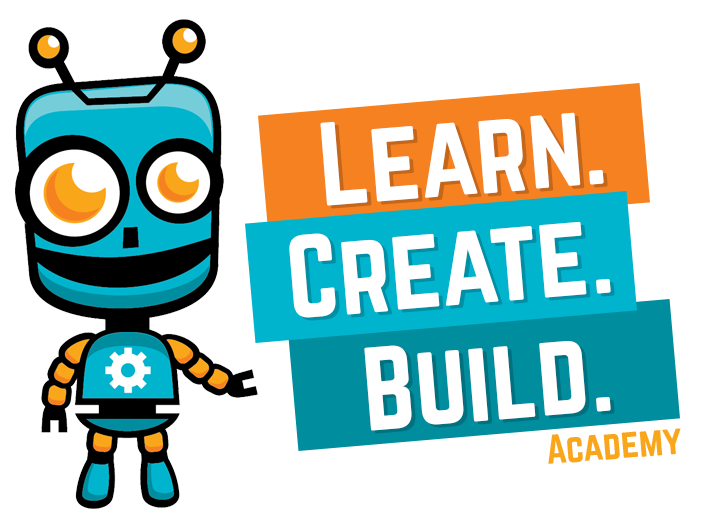

# Gatsby and Drupal Sitting in a Tree

Shane Thomas

---

## Some Background Info

- An Entrepreneurial Web Developer
- Drupal and I go way back
- Like to keep my pulse on the new hotness

___

# I do a lot of things

___

## Code Karate

- I teach people about Drupal
- 200+ videos with over 2 Million views
- <a href="http://codekarate.com">CodeKarate.com</a>

___

## Third & Grove

- Developer at Third & Grove
- We build digital experiences with Drupal, Gatsby, Shopify, and more.
- We work with organizations such as Mint, Quicken, Google, GE, and more
- <a href="http://thirdandgrove.com">ThirdAndGrove.com</a>

___

## Learn Create Build Academy

- Co-founder
- We inspire and educate the next generation of innovators
- We teach kids 7 to 14 years-old STEM skills through live online classes.
- <a href="http://learncreatebuild.com">LearnCreateBuild.com</a>

