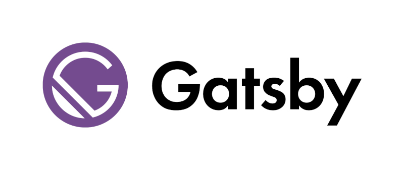
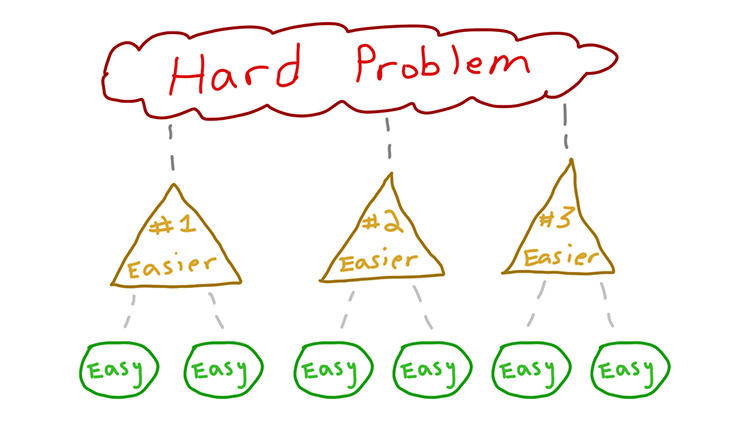
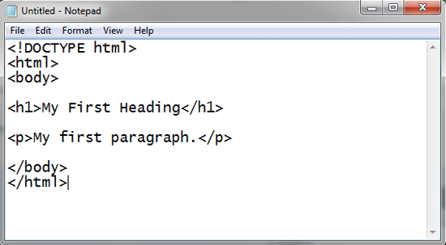
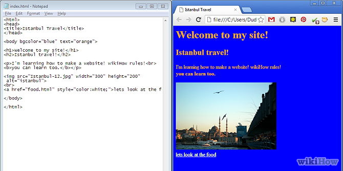
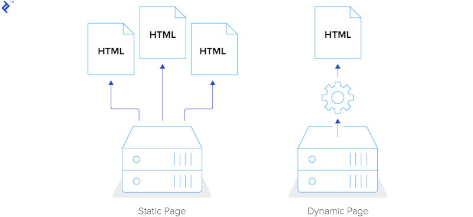

# Gatsby

___

___

# What is Gatsby

> Gatsby is a free and open source framework based on React that helps developers build blazing fast websites and apps
> <cite>Gatsbyjs.org</cite>

___

# So What is React?

___

# ReactJS

> A JavaScript library for building user interfaces
> <cite>ReactJS.org</cite>

___

___

# What is Drupal

> We're the leading open-source CMS for ambitious digital experiences that reach your audience across multiple channels.
> Because we all have different needs, Drupal allows you to create a unique space in a world of cookie-cutter solutions.
> <cite>Drupal.org</cite>

___

___

# What is GraphQL

> A query language for your API
> <cite>GraphQL.org

___

# But What Does This Really Mean?

___

___

## Gatsby is a Static Site Generator

...but it is also much more than that.

Because it's built with React

`Gatsby != Static`

___

___

___

___

___

## Drupal is a CMS

and it's also a powerful data modeling tool.

It makes it easy to make that data available through an API

___

## GraphQL is the Glue

It makes it easy to pull data from your Drupal site

and process it with Gatsby

___

# Before We Get Started

Just a few simple warnings...

___

# I'm not a Gatsby Expert

___

# I'm also not a comedian

Or even close for that matter

___

# I try really hard at both

___

## Gatsby is great at pulling in data to make a fast website.

## Drupal is great exposing it's data through an API

___

___

# Gatsby works great with other content sources

___

# Wordpress

___

# Netlify CMS

___

# Contentful CMS

___

# You can also source from Databases

Mysql, PostgresSQL, etc.

___

# Or from the filesystem

Hint: That's what I'm doing with this slideshow

___

It's built with Gatsby and uses markdown files for the slides.

P.S. I'm sorry I'm not a designer!

___

# But why do I need Gatsby?

Isn't my current CMS enough on it's own?

___

# Maybe...

But there is a difference in development philosophy that might make it more clear.

___

## Gatsby is built from the ground up to be fast

You have to work really hard to build a slow Gatsby site.

___

## Drupal (and other CMSs) are built with a lot of features

You have to work really hard to make them fast

Usually this is accomplished by adding multiple caching layers at different levels

Most of these caching layers are trying to make the sites as static is possible (which is what Gatsby is out of the box),
Therefore, all your really trying to do is make your CMS perform like a Static site.
___

<cite>Side Note: I don't know if CMSs is a word, but it works for me</cite>

