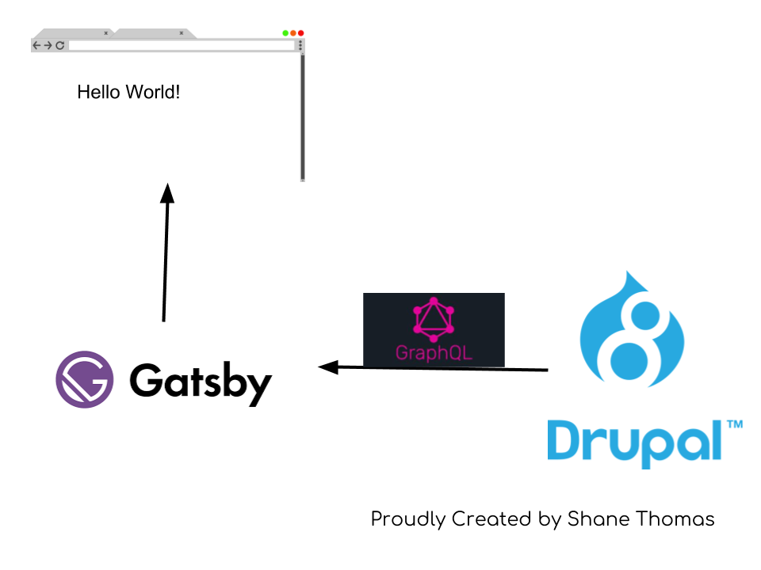

## Time for a Demo

<cite>Let's live a little dangerously</cite>

___

# What are we going to do?

1. Look at a local Drupal site
2. Create some posts
3. Spin up a local Gatsby site
4. Pull in those posts from Drupal
5. Look through some Gatsby/React code

___

## Some things we will learn

- How to configure Drupal to work with Gatsby
- How to configure Gatsby to consume Drupal content
- A high level overview of GraphQL

___

