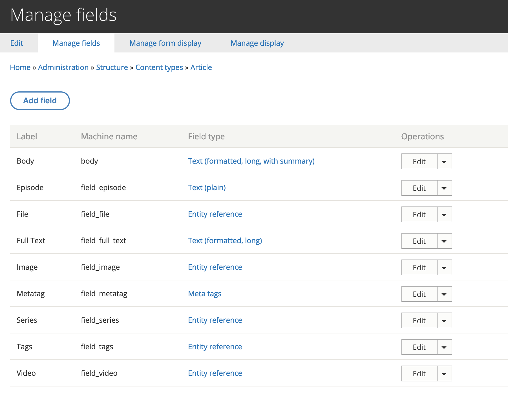
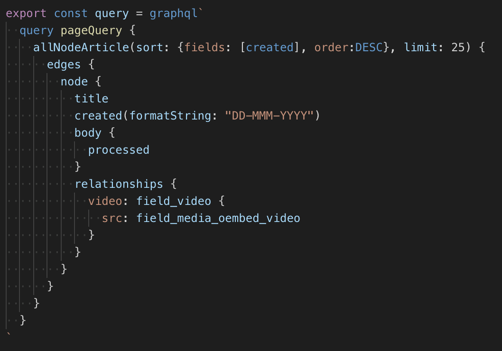

# Let's Recap


___

## On the Drupal Side

___

# Content Types

<div class="image-slide">


- Drupal uses Content Types that allow you to store data.
- These could be things like Blog Posts, Articles, Pages, or any type of "content" you want on your site.

</div>

___

# Fields

<div class="image-slide">



- You can add fields to these content types
- Fields could be any type of information related to that content
- Examples are images, text, dates, taxonomy terms/categories

</div>

___

# Expose the Data

<div class="image-slide">


- We expose the data by turning on the *JSON:API* module
- <cite>that's it</cite>

___

## On the Gatsby Side

Start by creating a new Gatsby Project

```
gatsby new my-project
```

___

# Gatsby Drupal Source Plugin

We install the Gatsby Source Drupal plugin

```
npm install --save gatsby-source-drupal
```

___

## In gatsby-config.js


___

# GraphQL is the connector between the two

It allows us to pull in data using something that looks like...

___



___

## Gatsby creates all of the pages in gatsby-node.js


___


___

## This maps to a template

This template defines what data you will receive

as well as how to display that data

___

## In the end, it's all React components

This means you can do anything that you normally could do with React.
