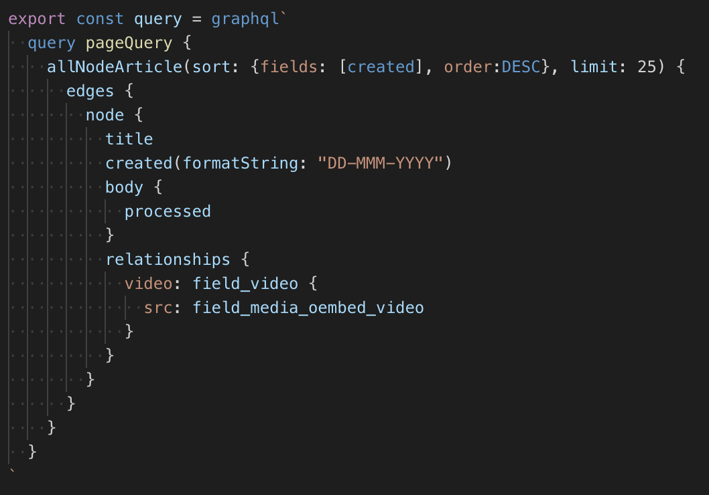
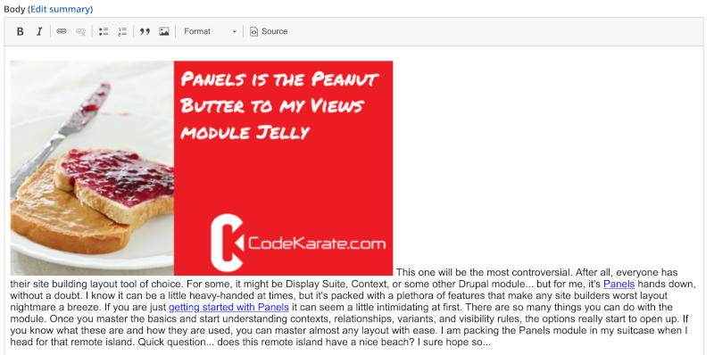

## There are some gotchas though

[Add funny image here]

___

# Images/Videos with Drupal Media

<div class="image-slide">



- By default you need to look in *relationships {}* in your graphql query.

</div>

___

# Inline Images

You have to go through extra steps to get images that are entered through the WYSIWYG editor.



___

# Embedded video

I had to do some manipuation with URL's to get Youtube videos to embed correctly.

I haven't worked with local videos, but Gatsby has a plugin for it.

___

# Drupal Paragraphs / Entity References

It's difficult to work with these more complex data structures

___

# Hosting is... different

___

# Deploying a Gatsby site

Step 1:

```
gastby build
```

Step 2: Upload static files to hosting provider

Overall, it's pretty simple

___

# Hosting is...

Cheaper

More secure

___

# But it's also...

More complicated in some ways

If you also want to host your Drupal site somewhere other than on your local computer.

___

# Some Solutions

___

# Pantheon

Free development environment (which means you could host your Drupal backend for free)

___

# Netlify, Github Pages, Cloudfront, etc

___

# Drupal Build Hooks Module

Allows you to automatically build your Gatsby site when you create or update content.

___

## But this isn't always a good thing

Especially on larger sites

___

# Special Considerations

Multiple content editors

CDN concerns

Posts that need to go live at a specific time

___

## Ultimately, you will need to develop a process that works for you

