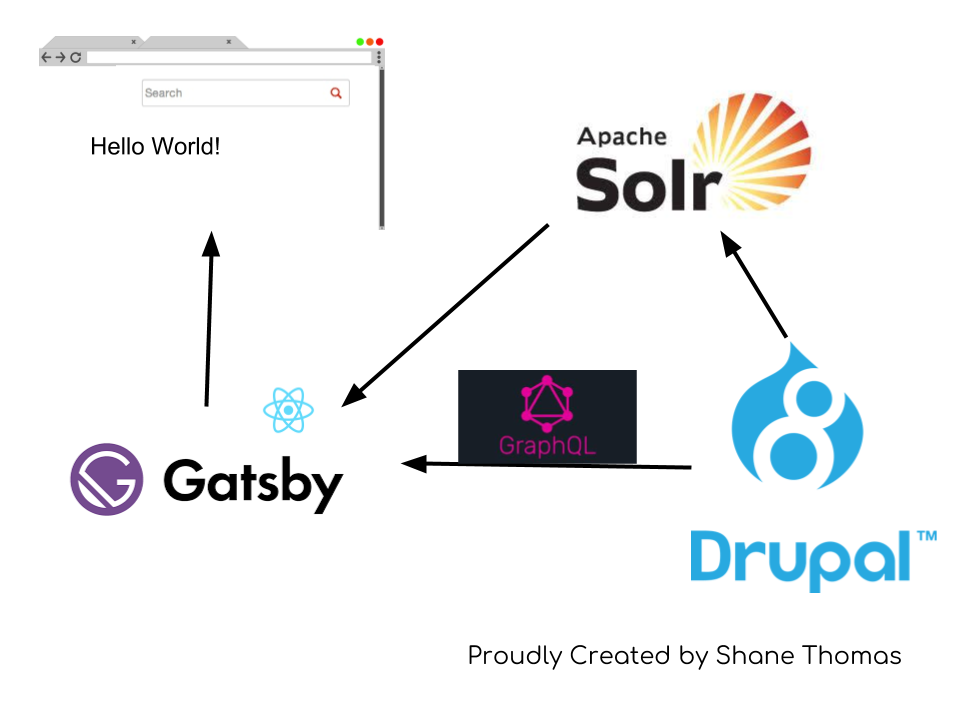

# But it's so... static

Luckily, it's built on React

Now let's look at ways you could make it more dynamic.

___

## If you were hosting a public Drupal site, you could use React for

# User Authentication

___

## This would allow you to

Display dynamic content based on the user (orders, user info, etc)

Allow interactions that send data back to the Drupal site (adding comments, filling out contact forms, etc)

___

## You could also do things like

Interact with a third party search library (like Solr)

Display search results with React components

Index the search results through your Drupal website

___

# The Tech Stack

___

# But that content editing experience is...

## ...less than ideal

___

## Introducing Gatsby Drupal Live Preview

Time for another demo!

___

## What you need to test it out

https://www.youtube.com/watch?v=H72PY3wNMcI

___

## Future Roadmap

Keystroke preview

Content moderation
